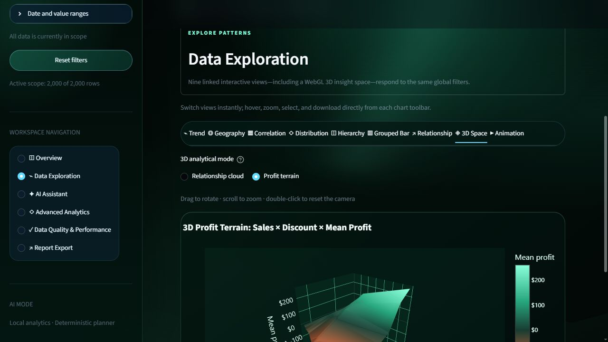
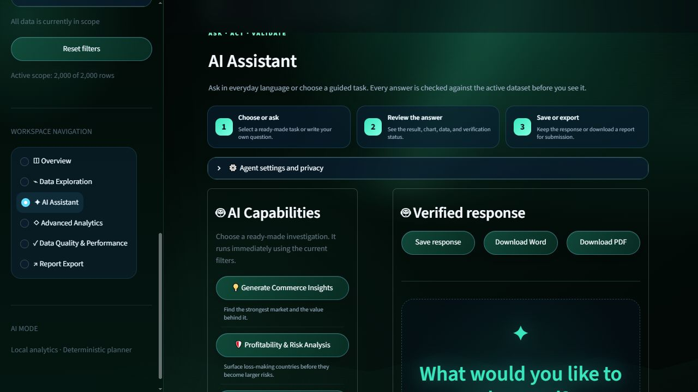

# AI-Powered E-Commerce Analytics

[](https://www.python.org/)
[](https://streamlit.io/)
[](LICENSE)
[](https://github.com/Monokayser/ai-ecommerce-analytics)
[](https://beah4wbufhqjqgzanubteb.streamlit.app/)

A production-style Streamlit capstone that turns e-commerce files into secure, filter-aware dashboards, natural-language analytics, advanced analysis, and downloadable reports. It works immediately without an API key and upgrades to real-time Gemini planning when a free Gemini API key is configured.






## What it does

- Loads validated CSV, JSON, and Parquet uploads up to a configurable 200 MB limit.
- Uses a responsive aurora-terrain interface with a large, equally spaced six-feature workspace grid, click-to-Home product mark, fully theme-matched emerald filters, dimensional glass surfaces, data-driven animated telemetry rails, and purposeful hover motion—with accessible reduced-motion behavior.
- Preserves raw data, cleans a working copy, resolves aliases, profiles every column, and records each cleaning action.
- Queries data through DuckDB with parameterized filters, row limits, timing, and a 10-second interrupt guard.
- Answers questions through a reference-inspired AI agent console with capability presets, a natural-language task box, live pipeline-stage feedback, Fast/Balanced/Deep response modes, saved responses, verified follow-ups, visible safety evidence, and a deterministic private fallback.
- Parses generated SQL with sqlglot and accepts only one read-only `SELECT`/`WITH` query on the registered `dataset` table.
- Includes six application sections and nine Plotly visualization workspaces with time-range controls, hierarchy drill-down, grouped/stacked switching, selectable relationship measures, configurable WebGL axes, a verified 3D profit terrain, fixed-range animation, anomaly detection, subset comparison, and Word/PDF/PNG/SVG export.
- Displays pipeline stages, the validated query, timing, retry/fallback status, and verified evidence—never hidden reasoning.

## Why Gemini 3.6 Flash

Gemini 3.6 Flash is the default hosted planner because it is a stable, low-latency model with native JSON Schema structured output and an API free tier suitable for development and small projects. Fast mode uses one low-effort hosted planning pass plus a local computed summary; Balanced uses medium planning and a concise AI narrative; Deep raises model effort and narrative detail for harder investigations. See [docs/model_selection.md](docs/model_selection.md) for the decision matrix and privacy notes.

No key is required to use the platform. If Gemini is not configured, rate-limited, or unavailable, the same validated query pipeline automatically uses the deterministic local planner and tells the user that fallback occurred.

## Quick start

Requirements: Python 3.11 and Chrome/Chromium for static Plotly export.

```powershell
git clone https://github.com/Monokayser/ai-ecommerce-analytics.git
cd ai-ecommerce-analytics
python -m venv .venv
.venv\Scripts\Activate.ps1
python -m pip install --upgrade pip
python -m pip install -r requirements.txt
Copy-Item .env.example .env
streamlit run app.py
```

On macOS/Linux, activate with `source .venv/bin/activate`, copy with `cp .env.example .env`, and run the same install/Streamlit commands.

## Enable real-time hosted AI

Create a Gemini API key in [Google AI Studio](https://aistudio.google.com/apikey), then put it only in your local `.env`:

```dotenv
LLM_PROVIDER=gemini
GEMINI_API_KEY=your_key_here
GEMINI_MODEL=gemini-3.6-flash
LLM_QUERY_REASONING_EFFORT=medium
LLM_NARRATIVE_REASONING_EFFORT=low
```

Never commit `.env` or `.streamlit/secrets.toml`. OpenAI, local Ollama, and local LM Studio remain supported provider-neutral alternatives; see `.env.example`.

### Enable private real-time AI with LM Studio

LM Studio is the recommended no-per-request-cost option when the machine has enough memory for a capable local model. Load a structured-output-capable model, start the local server, and configure:

```dotenv
LLM_PROVIDER=lmstudio
LM_STUDIO_BASE_URL=http://localhost:1234/v1
LM_STUDIO_MODEL=openai/gpt-oss-20b
LM_STUDIO_API_KEY=lm-studio
```

The model proposes a typed plan only. Every query is still revalidated locally and executed through the read-only DuckDB or restricted pandas layer. If the endpoint is unavailable, the assistant discloses the failure and uses the deterministic planner. See [LM Studio structured output](https://lmstudio.ai/docs/developer/openai-compat/structured-output).

## Data and demo status

Upload a file in the sidebar or use the included deterministic 2,000-row synthetic dataset at `data/sample/demo_ecommerce_sales.csv`. Demo data is visibly labeled and is not represented as official evidence. Official-demo readiness requires a non-demo dataset with at least 5,000 rows.

## Repository structure

```text
ai_ecommerce_analytics/
|-- app.py                    # Streamlit entry point and routing
|-- config/                   # Environment settings and logging
|-- src/
|   |-- data/                 # Loading, cleaning, profiling, DuckDB
|   |-- llm/                  # Providers, prompts, planners, validation
|   |-- analytics/            # Anomaly and comparison services
|   |-- visualization/        # Chart selection and constructors
|   |-- reporting/            # Word, PDF, PNG, and SVG export
|   `-- ui/                   # Six Streamlit sections and shared theme
|-- tests/                    # Unit, security, export, and app tests
|-- benchmarks/               # Ten-question measured benchmark runner
|-- docs/                     # Architecture, security, production hardening
|-- reports/                  # Academic report and presentation assets
|-- .github/                  # Issue and pull-request templates
|-- docs/github-actions-ci.yml # CI workflow template (activation-ready)
|-- Dockerfile
`-- docker-compose.yml
```

## Test and benchmark

```powershell
python -m pip install -r requirements-dev.txt
python -m pytest -q
python -m pytest --cov=src --cov=config --cov-report=term-missing
python benchmarks/benchmark_runner.py
```

Without a hosted key, live benchmark rows are recorded as `not_run`; the runner never invents model results. For a live Gemini run:

```powershell
$env:RUN_LIVE_LLM_TESTS="1"
python benchmarks/benchmark_runner.py --provider gemini --dataset data/raw/global_ecommerce_sales.csv
```

## Deployment

**Live public application:** [https://beah4wbufhqjqgzanubteb.streamlit.app/](https://beah4wbufhqjqgzanubteb.streamlit.app/)

The repository is prepared for Streamlit Community Cloud (`app.py`, `runtime.txt`, `packages.txt`, and pinned requirements) and Docker. Follow [docs/deployment.md](docs/deployment.md) for GitHub, secrets, deployment, health checks, and troubleshooting.

The source repository is public. To create the public website, sign in to [Streamlit Community Cloud](https://share.streamlit.io/) with GitHub and deploy these coordinates:

```text
Repository: Monokayser/ai-ecommerce-analytics
Branch: main
Entrypoint: app.py
Python: 3.11
```

Because the repository is public, Streamlit Community Cloud makes the deployed app public by default. For account security, GitHub requires the repository owner to approve the one-time OAuth sign-in.

Cross-browser behavior, responsive breakpoints, accessibility controls, performance budgets, container hardening, and scaling guidance are documented in [docs/production_hardening.md](docs/production_hardening.md).

```powershell
docker build -t ai-ecommerce-analytics .
docker run --env-file .env -p 8501:8501 ai-ecommerce-analytics
```

## Security

LLM output is treated as untrusted data. SQL is parsed and restricted; pandas fallback uses a custom allowlisted AST interpreter without `eval` or `exec`; uploads, samples, results, timeouts, retries, and retained conversation evidence are bounded. See [docs/security.md](docs/security.md) and [SECURITY.md](SECURITY.md).

## Academic integrity

AI coding assistance helped scaffold, implement, test, and document this project. Submitters must review and understand every component, disclose the actual assistance used, and replace placeholder dataset references with the approved course dataset source. Live benchmark evidence must be measured and must not be fabricated.

## Academic submission artefacts

The repository includes the professionally formatted capstone evidence pack:

- [Academic report — Word](reports/generated/AI_Ecommerce_Analytics_Academic_Report.docx)
- [Academic report — PDF](reports/generated/AI_Ecommerce_Analytics_Academic_Report.pdf) — verified at the assignment maximum of 20 pages
- [Capstone presentation — PowerPoint](reports/generated/AI_Ecommerce_Analytics_Capstone_Presentation.pptx) — 18 slides for a 15-minute presentation plus Q&A

The report uses measured local evidence only. It labels the 2,000-row seed-42 dataset as synthetic development data and leaves live-provider benchmark rows as `not_run` until an API key is configured. Replace the editable student-ID, team-member, final-date, and deployed-URL placeholders before submission.

Rebuild the report figures and Word report with:

```bash
python scripts/generate_academic_assets.py
python scripts/generate_academic_report.py
```

On Windows with Microsoft Word installed, export the matching PDF with:

```powershell
powershell -ExecutionPolicy Bypass -File scripts/export_report_pdf.ps1 `
  -InputDocx reports/generated/AI_Ecommerce_Analytics_Academic_Report.docx `
  -OutputPdf reports/generated/AI_Ecommerce_Analytics_Academic_Report.pdf
```

## License

Released under the [MIT License](LICENSE).
