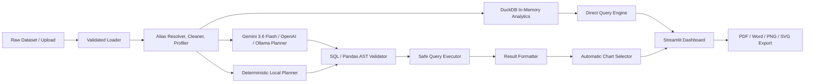

# System Architecture

## Data flow

## Layer responsibilities

- **UI:** session state, controls, accessibility, progress, and presentation. It does not contain analytical rules.
- **Data:** loading, canonicalization, cleaning, profiling, query construction, execution, and timing.
- **AI:** provider abstraction, Gemini-native JSON Schema output, deterministic no-key planner, prompt policy, evidence building, validation, one correction attempt, bounded provider retry, and five-turn memory.
- **Visualization:** deterministic selection and reusable Plotly constructors.
- **Advanced analytics:** deterministic anomaly and comparison calculations; the LLM only explains verified results.
- **Reporting:** provider-independent `ReportPayload` to styled Word/PDF output.

All components use typed Pydantic contracts so UI, test, and provider implementations can change independently.
